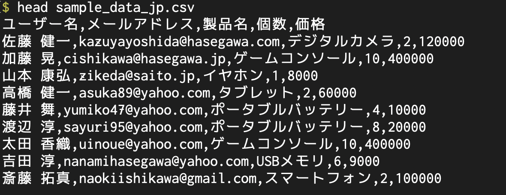
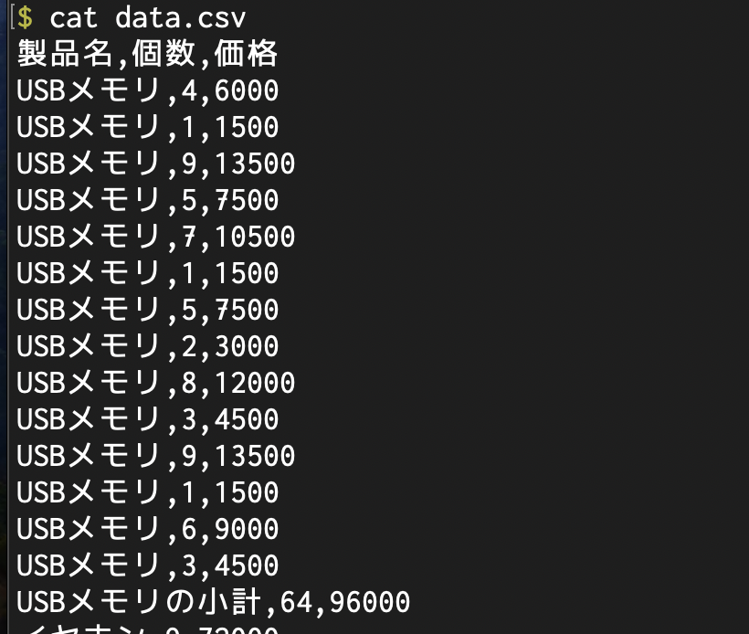
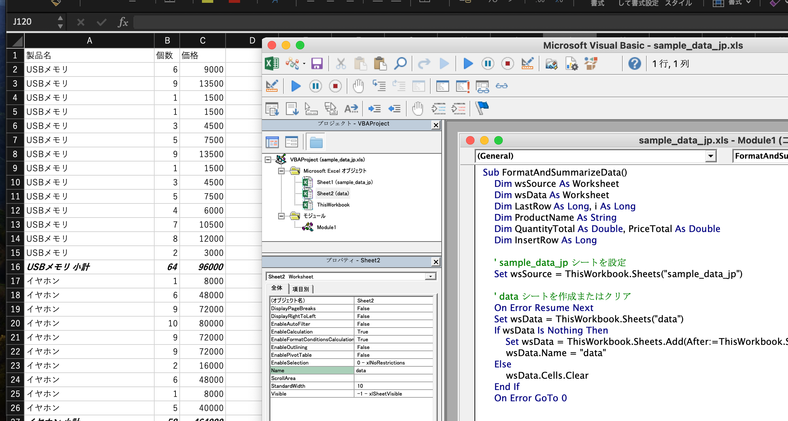

# csv の変換


## サンプルデータの作成

chatGPT へのプロンプト

```
ユーザー名、メールアドレス、製品名、個数、価格の列を持つ 100 行の csv ファイルを作成してください。
ユーザー名、製品名は日本語にしてください。製品の種類は10種類としてください。
```

```
UTF8 の CSV を mac の excel で読み込むと文字化けします。
```



## VBA

chatGPT へのプロンプト

```
ユーザー名、メールアドレス、商品名、個数、価格の列を持つ スプレッドシートがあります。
シート名は "sample_data_jp" とします。

次の操作をする VBA を書いてください。

シート "data" をつくります。すでに存在しているなら内容をクリアします。

シート "data"の内容は次のようなものとします。
なお この詐称でシート "sample_data_jp" の内容は変化させないでください。

ユーザー名列、メールアドレス列は削除されている。
商品名でソートされている。
商品ごとにその商品の個数と価格の小計行がデータの最後に挿入されている。
小計行は太字, イタリックにする。
各列の表示幅を適切なものに設置する。
```

VBA
```
Sub FormatAndSummarizeData()
    Dim wsSource As Worksheet
    Dim wsData As Worksheet
    Dim LastRow As Long, i As Long
    Dim ProductName As String
    Dim QuantityTotal As Double, PriceTotal As Double
    Dim InsertRow As Long

    ' sample_data_jp シートを設定
    Set wsSource = ThisWorkbook.Sheets("sample_data_jp")

    ' data シートを作成またはクリア
    On Error Resume Next
    Set wsData = ThisWorkbook.Sheets("data")
    If wsData Is Nothing Then
        Set wsData = ThisWorkbook.Sheets.Add(After:=ThisWorkbook.Sheets(ThisWorkbook.Sheets.Count))
        wsData.Name = "data"
    Else
        wsData.Cells.Clear
    End If
    On Error GoTo 0

    ' sample_data_jp から data にデータをコピー
    LastRow = wsSource.Cells(wsSource.Rows.Count, "C").End(xlUp).Row
    wsSource.Range("C1:E" & LastRow).Copy Destination:=wsData.Range("A1")

    ' 商品名でソート
    With wsData.Sort
        .SortFields.Clear
        .SortFields.Add Key:=wsData.Range("A2:A" & LastRow), Order:=xlAscending
        .SetRange wsData.Range("A1:C" & LastRow)
        .Header = xlYes
        .Apply
    End With

    ' 列幅の調整
    wsData.Columns("A:C").AutoFit

    ' 初期化
    ProductName = wsData.Cells(LastRow, 1).Value
    QuantityTotal = 0
    PriceTotal = 0
    InsertRow = LastRow + 1 ' 小計を挿入する行

    ' ループを逆方向に実行
    For i = LastRow To 2 Step -1
        ' 数値を合計に追加
        If IsNumeric(wsData.Cells(i, 2).Value) Then QuantityTotal = QuantityTotal + wsData.Cells(i, 2).Value
        If IsNumeric(wsData.Cells(i, 3).Value) Then PriceTotal = PriceTotal + wsData.Cells(i, 3).Value

        ' 新しい商品名が出現した場合、小計を挿入
        If wsData.Cells(i - 1, 1).Value <> ProductName Then
            wsData.Rows(InsertRow).Insert Shift:=xlDown, CopyOrigin:=xlFormatFromLeftOrAbove
            With wsData.Rows(InsertRow)
                .Cells(1).Value = ProductName & " 小計"
                .Cells(2).Value = QuantityTotal
                .Cells(3).Value = PriceTotal
                .Font.Bold = True
                .Font.Italic = True
            End With

            ' 合計をリセット
            ProductName = wsData.Cells(i - 1, 1).Value
            QuantityTotal = 0
            PriceTotal = 0
            InsertRow = i ' 小計行を挿入する位置を更新
        End If
    Next i

    ' 列幅の調整
    wsData.Columns("A:C").AutoFit
End Sub
```

## python

chatGPT へのプロンプト
```
ユーザー名、メールアドレス、商品名、個数、価格の列を持つ csv ファイルがあります。
ファイル名は "sample_data_jp.csv" とします。

次の処理をする python プログラム を書いてください。

ファイル名 "data.csv" の csv をつくります。すでに存在しているなら内容をクリアします。

data.csv の内容は次のようなものとします。
なお この操作で "sample_data_jp.csv" の内容は変化させないでください。

* ユーザー名列、メールアドレス列は削除されている。
* 商品名でソートされている。
* 商品ごとにその商品の個数と価格の小計行がデータの最後に挿入されている。
```

convert.py
```
import pandas as pd

# CSVファイルを読み込む
file_path = 'sample_data_jp.csv'
sample_data = pd.read_csv(file_path)

# 1. ユーザー名とメールアドレスの列を削除
data_cleaned = sample_data.drop(['ユーザー名', 'メールアドレス'], axis=1)

# 2. 商品名でデータをソート
data_sorted = data_cleaned.sort_values(by='製品名')

# 3. 各商品ごとに個数と価格の小計を計算し、小計行を追加する
# 商品名ごとのグループを作成して小計を計算
subtotal_data = data_sorted.groupby('製品名').apply(lambda x: pd.Series({
    '個数': x['個数'].sum(),
    '価格': x['価格'].sum()  # x['個数'].dot(x['価格'])
})).reset_index()

# 小計行を'小計'という製品名でマーク
subtotal_data['製品名'] = subtotal_data['製品名'] + 'の小計'

# 元のデータと小計データを結合
final_data = pd.concat([data_sorted, subtotal_data]).sort_values(by='製品名', kind='mergesort')

# 4. 新しい `data.csv` ファイルに結果を書き出す
output_file_path = 'data.csv'
final_data.to_csv(output_file_path, index=False)  # インデックスは書き出さない
```

## 変換結果

python3 convert.py を実行すると、data.csv が生成される。


sample_data_ja.cav を Excel で開いて、VBA のプログラムを登録しm実機雨させると、タブ [data] が生成される。

